# **Food Survey**

Live Website: [Food Survey](https://django-ms-bistro-db8ecf4c30b8.herokuapp.com)

A small bistro located on the main street of Novi Sad, Serbia. Since this reservation system for said hypothetical website is based on a physical location, timezone details were omitted (unnecessary).

**ERD**
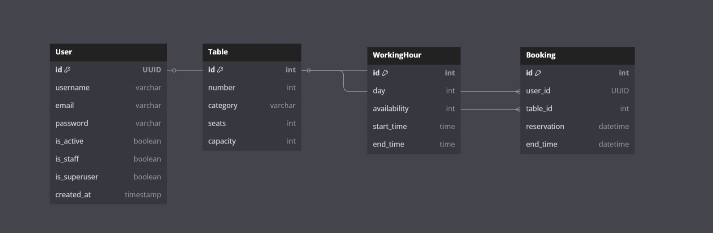

**Wireframes**

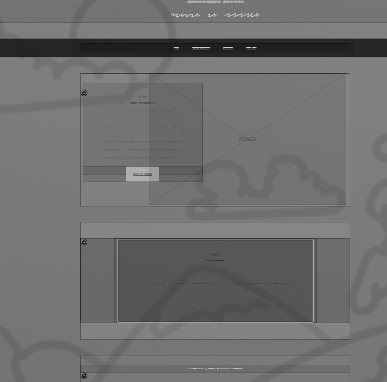
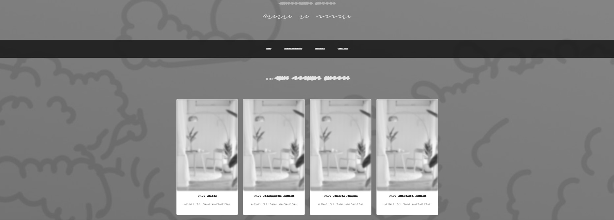
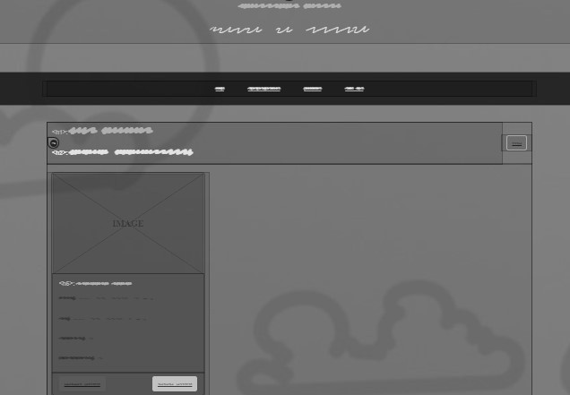
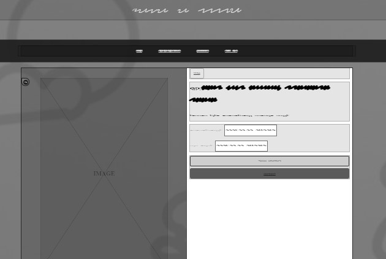
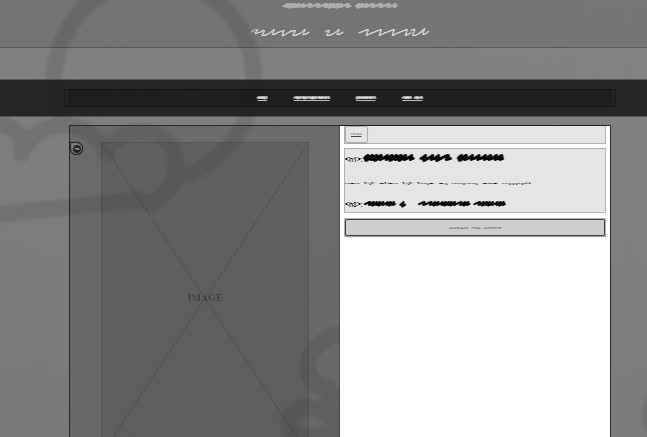

Generated with wireframify and page to wireframes

## **Project Goals**

To create a "proof of concept" of an up-scale restaurant, ready to receive reservations.

***

## **User Goals**

### **First Time Users Goals**

+ As a customer, I want to make reservations online
+ As a business owner, I want to be able to set my own working days
+ I know I want a reservation, but I'd like to see table capacity

### **Frequent User Goals**

+ I love eating out, and I don't want to wait for a table
+ Although our hours are usually consistent, I'd like to have the flexibility to block certain days from being reserved
+ I'm a very busy person, and I often make reservations in a rush -- I want to be sure my reservations are flexible.

### **All User goals**

+ I want to reserve a table to make sure I don't have to wait
+ I want to be sure my reservations are when the restaurant is open
+ I can live without seeing a menu online, but I want to see all my options are tables

### **Fulfillment**

The table list will allow logged in users to see all four classes of table available to them
> I can live without seeing a menu online, but I want to see all my options are tables

The easy to use reservation system ensures you won't have to wait!
> I love eating out, and I don't want to wait for a table

> As a customer, I want to make reservations online

> I want to reserve a table to make sure I don't have to wait

Rather than fixed dates, working hours are configurable in the admin panel. Admins can select whether a day is available or not, as well as its specific hours. (Any input can be given for working hours on closed days)
>Although our hours are usually consistent, I'd like to have the flexibility to block certain days from being reserved

>As a business owner, I want to be able to set my own working days

Reservations can be cancelled or modified from the booking list panel, which is visible to all logged in users.
>I'm a very busy person, and I often make reservations in a rush -- I want to be sure my reservations are flexible.

Table capacity is listed upon clicking any of the table options!
>I know I want a reservation, but I'd like to see table capacity

Form validation has been undertaken to ensure reservations comply not only with working hours/days, but also cannot be set in the past or for more than three hours!
>I want to be sure my reservations are when the restaurant is open

***

## **Structure**

### **Navigation**

+ Upon opening the site, users are greeted with the bistro's dedication to high-quality ingredients
+ Users who are not logged in will not be able to create a booking
+ Users who are logged in are able to view their current reservation

**Starting Screen**  
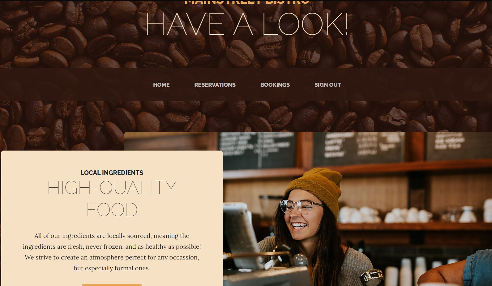

**Table List**  
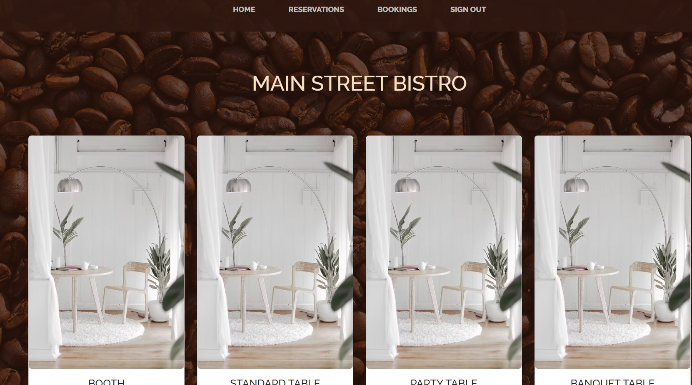

**Booking List**  

**Manage Booking**  
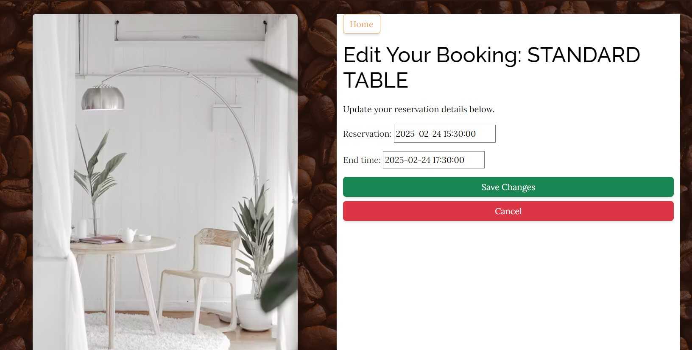

**Cancel Booking**
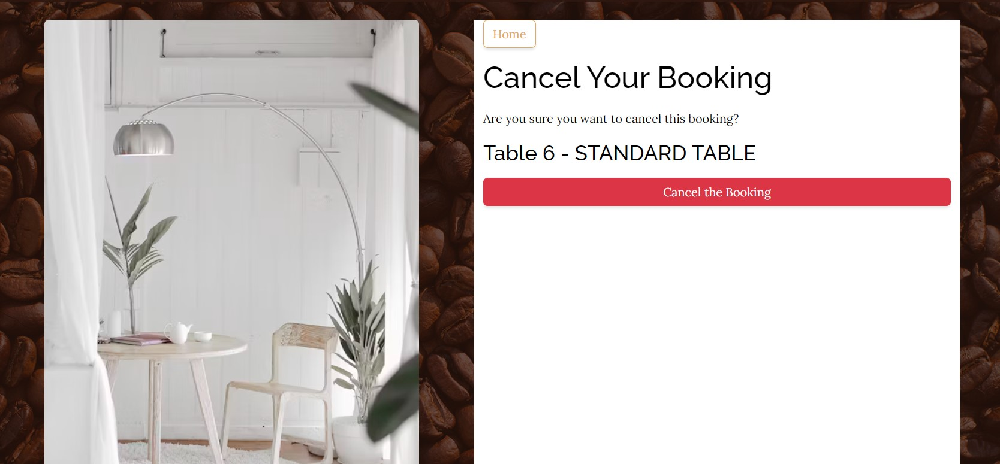

### **Reservation Input**

+ Reservations cannot be made in the past, or end in the past
+ Reservation is validated to make sure it complies with preset rules, both in the admin panel and preset time-limits
+ Input validation testing can be seen in the testing section.

**Input for managing reservations**
+ Reservation management follows the same rules as the initial reservation

+ Users cannot edit other users' bookings from the frontend, even as admins

**Reservation is valid**
+ If the reservation is valid, tables are available, and the bistro is open, users are redirected to a success htmlresponse page.

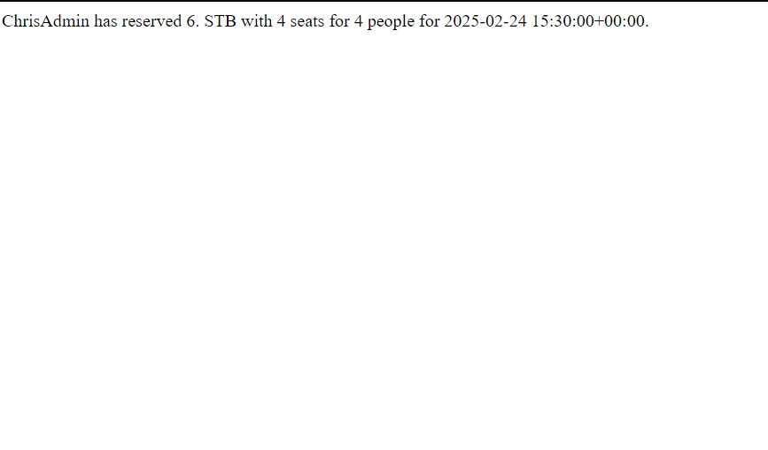

+ The table is then no longer available to be booked at the same time by others, and is accessible from the aforementioned booking list.

**Data is incorrect**
+ The template will refresh if there are any errors, and tell the user which things need to be fixed (type of table, time, day, etc)

## **Features**

### **Existing Features**

**Configurable Working Days**
+ Working days are configurable through the admin panel
+ This allows admins to block reservations during predetermined events or holidays
+ On the flipside, admins can also change the working hours for certain days, or even allow reservations on Sundays.

**Managing and Cancelling**
+ Users who have made a booking can cancel at any time
+ Users can also modify when their bookings will be
+ Nobody can change or cancel bookings from the frontend, other than the initial user

### **Features left to implement**

+ Better images
> The program currently uses images from the tutorial I followed, but they get the point across.
> The beans background isn't the worst fit for a bistro, but it's also not the best.

+ Calendar-based working days
> The admin panel working days could be changed to be based on a set calendar, with default values, but due to time-constraints this isn't possible.

+ Better success page
> It's just a blank htmlResponse right now, so that's not ideal

+ Email on reservation
> Right now, users could pull up their reservation from the site, but emails could make it easier.

***

## **Technologies**

### **Language**

+ [Python](https://www.python.org/)
    - Main programming language supporting this project
+ [Django](https://www.djangoproject.com)
    - Primary framework this project was written in

### **Libraries**

+ [AllAuth](https://docs.allauth.org/en/latest/)
    - Used to create users
+ [BootStrap](https://getbootstrap.com/docs/5.0/getting-started/introduction/)
    - Used to style the HTML

### **Tools**

+ [PIP](https://pypi.org/project/pip/)
    - Package installer for Python
+ [Git](https://git-scm.com/)
    - Version control system
+ [GitHub](https://github.com/)
    - Used to store and manage code
+ [Heroku](https://dashboard.heroku.com/)
    - Used to deploy the project
+ [Gitpod](https://gitpod.io)
    - Preferred IDE, used to actually write the code
+ [DBDiagraph](https://dbdiagram.io)
    - ERD visualization and generator
+ [CI Python Linter](https://pep8ci.herokuapp.com)
    - Code quality advisor software for error and mistakes detection

***

## **Testing**

+ Form validation was tested extensively throughout development
+ Since this is a local restaurant, local time is sufficient
+ Account-level testing was done to ensure nobody could vandalize other patrons' reservations
+ LoginRequired was tested to ensure users are routinely herded to make an account

### **Input Validation**

It is extremely crucial that reservations follow both chronological rules and working hours.

+ **Unacceptable Reservation Times.**

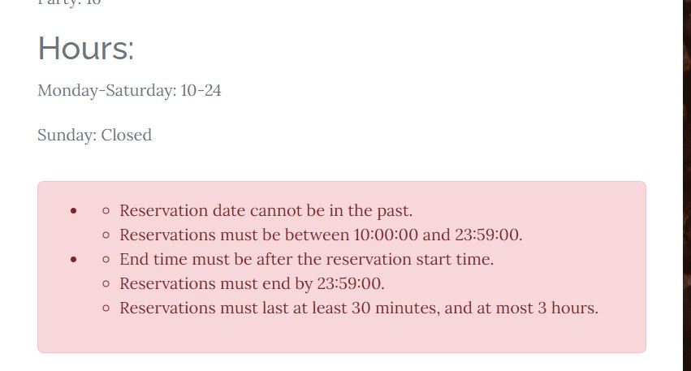

+ **Cannot be in the past**  
    - No dates before "now" are accepted, and reservations must end after they begin.

+ **Cannot exceed three hours or be less than 30 minutes**  
    - Therefor, it is impossible to create ridiculous reservations, meaning user experience for other visitors isn't compromised.

### **Input Validation Testing**

**Testing Results**
| Test                                              | Expected  | Result    | Intended Use |
| ------------------------------------------------- | --------- | --------- | ------------ |
| Users cannot make more than one booking           | AddError  | AddError  | Yes          |
| Users cannot view booking list without logging in | No Button | No Button | Yes          |
| Reservations can only be made during certain times| AddError  | AddError  | Yes          |
| Reservations must be made on working days         | AddError  | AddError  | Yes          |
| Reservations must end after they begin            | AddError  | AddError  | Yes          |
| Reservations cannot have any part in the past     | AddError  | AddError  | Yes          ||

### **Other Tests**

All Python files have been inspected using a pep8 linter, and no errors have been detected (barring a few lines being too long)

[Code Institute PEP8 Linter](https://pep8ci.herokuapp.com)

All HTML and CSS were run through the W3C linter from view source view
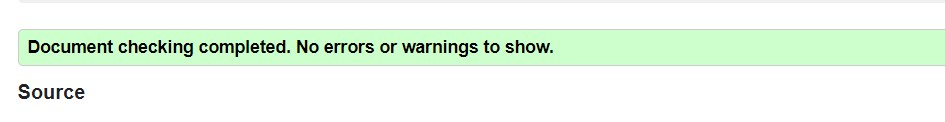
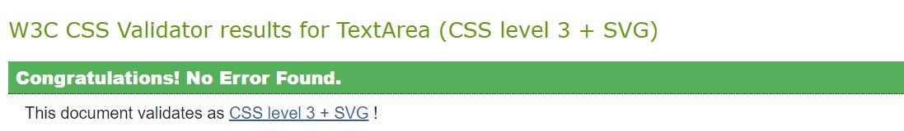

### **Unresolved Errors, Issues and Bugs**

No issues known so far

***

## **Deployment**

### **Project Creation**

The project was started by navigating to the [template provided](https://github.com/Code-Institute-Org/p3-template) and clicking 'Use this template'. Under Repository name I input food-survey and checked the 'Include all branches' checkbox. 

I found the program on my Github account by going to [Gitpod](https://gitpod.io), selecting "New Workspace", selecting my Github account, and searching for "Mainstreet Bistro".

+ git add . - This command was used to add all changes made to the file

+ git commit -m *commit message explaining the updates* - This command was used to commit changes to the local repository.

+ git push - This command is used to push all committed changes to the GitHub repository.

### **Run Locally**

1. Get the repository URL
2. Go to Gitpod.io
3. Select New Project
4. Paste the repository URL
5. Select VSCode 1.90.1
6. Select preferred storage class
7. Hit "continue"
8. Type "python3 manage.py runserver"

To stop the script file:
+ "Ctrl + C" - To stop the current file from running

### **Deployment to Live Service**

My Food Survey project was deployed using the Gitpod IDE, using Git and GitHub for version control. It is hosted on Heroku.

1. Get Python file ready for deployment

> Ensure the Django project is ready for deployment and includes all necessary dependencies in a requirements.txt file using this command.

> pip3 freeze > requirements.txt

2. Configure static data

> Add whitespace, reconfigure static files to match Heroku standard

> git commit -m "..."  
> git push

3. Heroku starting a new project

> Visit the [Heroku](https://dashboard.heroku.com/) dashboard and click "New App" after that, give the project a name and select a region, next.

4. Heroku project settings

> In the project dashboard click "Settings" and head to the "Project Vars" section. CLick "Reveal Config Vars" opening two input fields. The first field has the database from Code Institute, while the second has the relevant secretkey

5. Connecting to GitHub

> Click the "Deploy" tab and select "GitHub" and then "Connect to Github".

6. Selecting the Project

> After successfully connecting to GitHub a search bar opens. Type the name of the repository your project is in. A dropdown menu will open, click on the correct repository. This links up the repository from GitHub to heroku.

7. Deployment

> Scroll down and select either "Automatic deploys" or "Manual deploy". After the deployment is finished, head over to the "Overview" tab on heroku. On the top right, click "Open app" a new tab will open with the deployed project.

8. Re-enter admin panel info

>Moving to Heroku, at least for me, wiped the WorkingHours and Tables from the admin panel -- so it's also necessary to recreate them on the Heroku side through the relevant admin panel.

***

## **Credits**

### **Project Idea**

The project was taken from the Project 4 ideas page in the FullstackDev program from CodeInstitute. 

### **Content**

The content of this page was created by me, aka. [Acelliott1218](https://github.com/acelliott1218), along with the template and tutorial credited below, plus snippets within the code's comments.

The Python code provided was made with the knowledge gained through the CodeInstitute Full Stack Developer course.

The internet was used to find answers to questions which were not covered in the CodeInstitute Course. These sources are credited in the comments of the document itself.

### **Acknowledgements**

[DarshannDev]((https://github.com/Darshan4114).) for the initial tutorial

Various commenters on Reddit, Stackoverflow, etc, credited in the comments

Django documentation

StartBootstrap Business Casual Theme

Certain code-snippets were run through ChatGPT to find errors, code has been refactored to make it more original

DBDiagram.io for the visual ERD

And [NixTS](https://github.com/NixTS) for the README from which this README's content is based on. (Reused the template from my Python project)